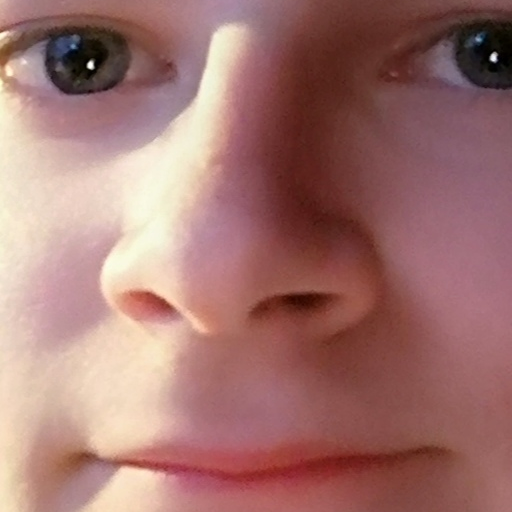

# Game-of-life
Robin's Game of Life with a toroidal grid and aging cells


## Contents

* [Introduction](#introduction)
* [How to Play](#how-to-play)

    - The Rules
    - Instructions
* [The Assignment](#the-assignment)
* [Installation](#installation)
    
    - Windows
    - MacOS
    - Linux

* [Sources](#sources)

## Introduction

Mathematician John Conway developed and designed a game called "Life" around the 70s. This game tried to form a complexity with even the most simplest rules. Like DNA with any variety of complex molecules can form life.

## How to Play

### The Rules

The game of life is played in a 2-dimensional field of cells in a grid. Each cell can be dead or alive. 
The game is played without any active players. The starting position of living cells can be decided by the player. When the living cells has been placed, the game can be started. This happens in rounds where cells die and where cells get born / revived. For that, the eight neighboring cells get checked. 

To decide if a living cells get killed:

* A cell with 2 or 3 living neighbors is kept alive.

* A cell with less than two or more than 3 living neighbors dies.

To decide if a dead cell gets revived:

* A dead cell with 3 living neighbors gets revived.

* A dead cell with more or less than 3 living neighbors stay dead.

### Instructions

To start the game. You can place your cells by clicking on each individual box visible on the screen. You'll know you have placed your cell if the box turns into a black color.

To start the simulation, press `Enter`.
> When the simulation has started. you can no longer place any cells until you stop the simulation.

To pause the simulation, press `Space`.

To clear the simulation, press `C`.

To randomize the simulation, press `R`.

To slow down the simulation, press `S`.

To speed up the simulation, press `F`.

## The Assignment

Our college assigned us to recreate The Game of Life. The catch is that we need to give it a creative approach. Do we want to make it more than just a game? Do we want to give it a unique twist? Do we just design the same game with a different visual approach ? This repository shows the people our approach.

## Installation

First off, make sure you have [python](#) installed. Then install the [pygame](#) library through terminal with:

### Windows

 ```powershell
 pip install pygame
 ```
Then change directories to `Game-of-life` and run `python -u .\source\app.py` in terminal. 

 ### MacOS

 ?

 ### Linux

 ?

## Sources

- [Conway's Game of Life](https://conwaylife.com/) by [Nathaniel Johnston](http://njohnston.ca/)

- [Checkbox variant with source code](https://huth.me/checkbox-life/) by [Andrew Huth](https://github.com/ahuth)

- [Original publication of Conway](web.stanford.edu)

- Our app icon is literally my face 

